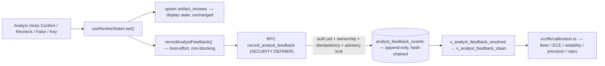

# Milestone: Calibration + Ground-Truth Capture

_Instrumentation-only. This milestone changes **no** live confidence calculation,
tier threshold, clustering behavior, analyst-confirmation effect, or orchestration
policy. It captures durable analyst ground truth and exposes read-only calibration
so confidence becomes **measurable** — the prerequisite for every later learning
feature (Bayesian reliability, tool reward, EIG, strategy learning)._

Status: implemented on branch `claude/insight-finder-prod-audit-b3yddb`, opened as
a **draft PR**. The migration is a repo file validated against real PostgreSQL 15
in CI; **it has NOT been applied to production** — that waits for review sign-off.

---

## 1. Audit of current analyst-action write paths (what exists today)

| Analyst action | Where it's written today | Persisted? |
|---|---|---|
| confirm / key / recheck / dismiss / wrong | `useReviewStates.set()` → upsert `artifact_reviews` (`src/lib/review.ts`) | Yes (state table, keyed `(user_id, artifact_id)`) |
| "wrong" also teaches a lesson | `save_agent_memories` RPC | Yes |
| accept pivot (= run it) | `proximity:run-pivot` event (`PivotsTab.tsx:152`) | No durable analyst-action row |
| reject pivot | — | **No write path exists** |
| merge / split / corrected entity | — | **No UI/write path exists** |
| manual tool selection | — | **No write path exists** |

**Consequence for scope:** the event model defines all requested action types
forward-compatibly. Wired in this PR: `confirm/key/recheck/dismiss/wrong`, plus
`retract` on reset and an implicit `confirm` when a note first reviews an artifact
(so the log never diverges from the product state). `accept_pivot/reject_pivot/merge/split/
corrected_entity/manual_tool_selection` are reserved in the enum and wired when
those UI actions exist (tracked as the follow-up in §10). `artifact_reviews`
stays the source of display state; the event log is a **parallel, append-only**
history — the two are independent by design.

---

## 2. Schema

New table `public.analyst_feedback_events` — immutable, append-only, hash-chained
per thread. Full provenance per event:

| Column | Type | Notes |
|---|---|---|
| `id` | uuid PK | |
| `seq` | bigint | per-thread monotonic (chain order); unique with `thread_id` |
| `thread_id` | uuid | |
| `artifact_id` | uuid null | null for non-artifact actions (e.g. manual_tool_selection) |
| `run_id` | text null | best-effort: `thread.run_started_at` at event time (no first-class run id exists yet) |
| `analyst_id` | uuid | **always `auth.uid()`** — never client-supplied |
| `action` | text | CHECK-constrained enum (12 actions) |
| `prior_state`, `resulting_state` | text | the transition |
| `reason` | text null | analyst note |
| `confidence_before`, `confidence_after` | int null | 0–100; equal this milestone (no confidence change) |
| `confidence_model_version` | text | stamped from `CONFIDENCE_MODEL_VERSION` (`src/lib/analyst-feedback.ts`) |
| `source_lineage` | jsonb | tools/source/classes that produced the artifact |
| `label_quality` | text | `clean`/`unresolved`/`contradictory`/`reversed` |
| `content_hash`, `prev_hash`, `chain_hash` | text | SHA-256 tamper-evident chain (mirrors `evidence_log`) |
| `created_at` | timestamptz | |

Indexes: `(thread_id, seq)` unique; `(analyst_id, created_at desc)`;
`(artifact_id) where not null`; `(confidence_model_version)`.

---

## 3. Migration plan & RLS review

Migration file: `supabase/migrations/20260717000000_analyst_feedback_events.sql`.
Idempotent (`IF NOT EXISTS`/`DROP … IF EXISTS`), reversible (a commented down
block is at the file's tail and is CI-safe because it's commented).

**Write path — the only way in — is `record_analyst_feedback()` (SECURITY DEFINER):**
- derives `analyst_id := auth.uid()`; raises if unauthenticated — **no
  client-supplied identity is trusted** (there is no `analyst_id` parameter);
- enforces `threads.user_id = auth.uid()` (tenant + thread ownership);
- enforces the artifact (when present) belongs to that thread;
- **idempotent**: if the caller's most recent event for `(thread, artifact)` is
  identical in `(action, resulting_state, reason)`, it returns that row
  (`deduped=true`) instead of appending — double-clicks/retries don't duplicate;
- serializes per-thread writers with `pg_advisory_xact_lock` so concurrent writes
  can't corrupt the `seq`/hash chain;
- appends with a SHA-256 chain (`prev_hash → chain_hash`).

**RLS & grants:**
- `ENABLE ROW LEVEL SECURITY`. Policy: authenticated may `SELECT` only rows where
  `auth.uid() = analyst_id`. No INSERT/UPDATE/DELETE policy for authenticated —
  all writes go through the definer RPC.
- Grants: `SELECT` to authenticated; `SELECT, INSERT` to service_role; `EXECUTE`
  on the RPC to authenticated + service_role (REVOKEd from PUBLIC).
- **Append-only for everyone** (incl. service_role and table owner): BEFORE
  UPDATE/DELETE row triggers + a BEFORE TRUNCATE statement trigger all RAISE.
  Corrections are new events, never edits — history is never silently mutated.

**Verified against real PostgreSQL 15** (`supabase/tests/analyst_feedback_events_test.sql`,
run in the reproduction below): happy path, idempotency, transition-append with
prior preserved, cross-tenant rejection, artifact/thread-mismatch rejection,
`analyst_id` derived from `auth.uid()`, direct-client-INSERT denied,
UPDATE/DELETE/TRUNCATE blocked, RLS read isolation (both directions),
latest-judgment-wins, model-version preserved, hash-chain linkage. Rollback drops
cleanly. (CI's "Migrations (psql validation)" job applies the migration on
postgres:15; the behavioral test can be run with the commands at the top of that
file.)

---

## 4. Event flow

The confidence engine does **not** appear in this flow — capture is a side channel.

---

## 5. Exact metric definitions (`src/lib/calibration.ts`, all unit-tested)

Let a clean label be `(p, y)` where `p = confidence/100 ∈ [0,1]` and `y ∈ {0,1}`
(1 = final resolved state is confirm/key; 0 = dismiss/wrong/reject). Unresolved
(`recheck`) and contradictory (cross-analyst disagreement) labels are excluded by
`v_analyst_feedback_clean`. Every metric returns its sample size, and every rate a
95% **Wilson** interval, so small-n numbers are never over-read.

- **Wilson(k,n)** — score interval for a binomial proportion; `n=0 → [0,1]`.
- **Brier** = mean `(p − y)²` (0 perfect, 0.25 = always 0.5, 1 = confidently wrong).
- **Reliability buckets** — per equal-width p-bin: mean predicted vs. empirical
  observed (with Wilson) and `gap = observed − predicted` (positive = under-confident).
- **ECE** = `Σ_b (n_b/N)·|observed_b − predicted_b|` (0 = perfectly calibrated).
- **Precision by band** — empirical `P(confirmed | confidence ∈ band)` over the
  display bands (90-100/75-89/55-74/35-54/0-34), each with n + Wilson.
- **rateByGroup** — confirm/reject rate grouped by tool / source family / kind.
- **False-confirmation rate** — of labels ever confirmed, fraction whose final
  resolved outcome is a rejection (a signal on the *ground truth's* own quality).
- **False-link rate** — of analyst merges, fraction later split/corrected (the
  cluster-integrity signal that feeds the next milestone).

---

## 6. Sample output from existing production data (read-only)

Pulled read-only from the current `artifact_reviews` ⋈ `artifacts` (the pre-event
ground truth that already exists — **539 analyst labels**). Sample sizes shown; a
selection-bias caveat follows.

**Precision by confidence band** (empirical `P(confirmed | band)`):

| Band | Resolved n | Confirmed | Empirical confirm rate |
|---|---|---|---|
| 90–100 | 16 | 16 | 1.00 |
| 75–89 | 50 | 50 | 1.00 |
| 55–74 | 218 | 186 | 0.853 |
| 35–54 | 182 | 164 | **0.901** |
| 0–34 | 37 | 30 | 0.811 |

**Two real findings this instrument already surfaces:**
1. **Non-monotonic mid-band calibration** — the 35–54 band confirms *more often*
   (0.901) than the 55–74 band (0.853). Confidence is not rank-ordering ground
   truth in the mid-range.
2. **Low band is wildly under-confident** — things scored 0–34 are confirmed 81%
   of the time.

**Mandatory caveat (label-quality §7):** these labels are **not** a clean random
sample. Analysts review a biased subset and tend to confirm what they chose to
investigate, so the low-band "81% confirmed" is very likely selection bias, not a
true calibration curve. The point of the milestone is to capture labels *with the
provenance and quality flags* needed to correct for this over time — not to act on
this raw table. Every metric in the module carries a Wilson interval precisely so
n=16 and n=218 are not read as equally trustworthy.

**Label distribution:** confirmed 263 · key 183 · dismissed 57 · recheck 36.

---

## 7. Label-quality rules (implemented)

- **Unresolved excluded:** `recheck`/no terminal verdict → `y = null` → dropped by
  `v_analyst_feedback_clean`.
- **Immediately-reversed handled:** the resolved view takes `DISTINCT ON (analyst,
  artifact) … ORDER BY seq DESC`, so only the analyst's *final* judgment counts.
- **Retraction (reset) handled:** resetting a review appends an immutable
  `retract` event (`resulting_state = new`); as the latest event it supersedes the
  withdrawn judgment (`y = NULL`) so the artifact drops out of the clean set —
  while all prior events remain (behavioral test #11). A note added to an
  unreviewed artifact (which implicitly confirms it in the product) emits a
  matching `confirm` event so the log never diverges from what the product shows.
- **Contradictory excluded:** an artifact with different resolved `y` across
  analysts is dropped from the clean view.
- **Analyst-confirmed ≠ independently-corroborated:** the event records the
  analyst verdict only; corroboration remains a separate (engine) signal. The doc
  and view names keep these distinct so a future Bayesian model can weight them
  differently.
- **No single click becomes a global rule:** this milestone only *measures*.
  Nothing here promotes a label into a lesson or a score change. (The existing
  "wrong → memory lesson" path is unchanged and out of scope.)
- **Negative labels are first-class:** dismiss/wrong/reject (and, later,
  split/corrected) are preserved as `y=0` outcomes, not discarded.

---

## 8. Performance, index & privacy analysis

- **Write:** one indexed insert + one advisory lock per analyst click. Analyst
  clicks are extremely low-frequency (human-paced), so contention is negligible;
  the per-thread advisory lock only serializes writers *within one thread*.
- **Read (calibration):** the views join events → artifacts on `artifact_id`
  (indexed) and group by band/kind/version. These are operator/analyst
  dashboards, not hot paths; if volume grows they can become a materialized view
  refreshed on a schedule (noted, not needed now).
- **Privacy:** events reference artifact ids + a `source_lineage` jsonb (tool/
  source/kind) and confidence — **no raw PII value is copied** into the event
  (the artifact value stays in `artifacts`). RLS confines reads to the owning
  analyst; cross-tenant aggregation is only possible via `service_role`
  (operator). `reason` is analyst free-text — treated as user content under the
  same tenancy rules.
- **Retention & rollback:** the table is immutable by design (no UPDATE/DELETE/
  TRUNCATE). Retention is therefore an explicit admin decision, not silent
  expiry; a retention job would be a separate, reviewed migration. Rollback =
  the commented down block (drops views, RPC, triggers, table) — verified to drop
  cleanly. Dropping discards collected ground truth (intended, documented).

---

## 9. Risks

1. **Selection bias in labels** (§6) — the biggest risk to *interpreting*
   calibration. Mitigation: always show n + intervals; treat early numbers as
   directional; never auto-tune scores from them (a hard rule of this milestone).
2. **`run_id` is best-effort** (thread `run_started_at`), not a stable per-run id.
   A first-class run id is a small follow-up if per-run calibration matters.
3. **Partial action coverage** — only review actions emit today (§1). Calibration
   over merges/pivots waits on those UI actions existing.
4. **Model-version discipline** — calibration-by-version is only meaningful if
   `CONFIDENCE_MODEL_VERSION` is bumped whenever confidence logic changes. This is
   a human process; documented at the constant.
5. **Write is best-effort** — an event-log failure is swallowed so it never breaks
   review UX, which means an outage silently drops labels. Acceptable for
   instrumentation; a durable client-side retry queue is a possible hardening.

---

## 10. Dependency sequence for the next milestones

1. **This milestone — calibration + ground-truth capture** (measures only). ✅
2. **Username-merge integrity fix** — wire `merge_guard.ts` + `isGenericHandle`
   into the live cluster merge. This milestone's `falseLinkRate` becomes its
   before/after metric.
3. **Server-authoritative confidence consolidation** — its **first task** is the
   authoritative prediction + investigation-context snapshot in §11 below, then
   one score in log-odds with analyst-confirmation as a Bayesian evidence source
   whose reliability is **read from this milestone's calibration**, not hardcoded.
4. **Confidence implementation + migration** — bump `CONFIDENCE_MODEL_VERSION`;
   calibration then compares old vs. new model versions directly.
5. **Tool reward + EIG instrumentation** — "actual gain" per tool call, computed
   against the labels captured here.
6. **Strategy learning + cross-investigation memory** — path success rates over
   completed, labeled investigations.

Everything downstream consumes the labels this milestone captures — which is why
it is first.

---

## 11. Deferred (next milestone, FIRST task): authoritative prediction + context snapshot

**Decision (do NOT do in this PR):** prediction and investigation-context are NOT
captured client-side at review time, and no partially-populated `prediction` /
`investigation_context` columns are added to this milestone. Reason: the
authoritative values (model/provider/reasoning versions, tool/time budget, source
diversity, run context) only exist at **backend artifact-scoring / orchestration
time**, not at the analyst's review-button click. Half-populated, client-derived
fields would create a schema contract before the authoritative source exists,
inviting duplicate migrations and data that looks complete but is not.

Instead, this is designed **once**, at the authoritative scoring event, as the
first task of the confidence-consolidation milestone. The snapshot is written when
the artifact is scored (one migration, one consistent schema) and the analyst
feedback event references it by artifact/run.

**Future schema (target) — one snapshot per scored artifact:**

| Field | Source (authoritative at) |
|---|---|
| `predicted_confidence` | scoring |
| `predicted_label` (tier) | scoring |
| `confidence_model_version` | scoring |
| `model_version` / `provider_versions` / `reasoning_version` | scoring / orchestration |
| `tool_chain` | orchestration |
| `entity_type` | thread seed |
| `investigation_phase` | orchestration |
| `known_artifact_count` | run state at scoring |
| `source_diversity` | run state at scoring |
| `contradiction_count` | run state at scoring |
| `remaining_tool_budget` / `remaining_time_budget` | orchestration |
| `run_id` | run |
| `scored_at` (scoring timestamp) | scoring |

**Authoritative-source rule:** where a backend value exists, it is authoritative.
No client-derived field is ever treated as authoritative in its place. The feedback
event's existing `confidence_before` / `confidence_model_version` remain a
convenience mirror; the snapshot is the system of record for prediction + context.

**Invariants this milestone already guarantees (confirmed before merge):**
1. Every analyst-feedback event is **immutable and queryable** — UPDATE / DELETE /
   TRUNCATE are blocked for all roles (behavioral tests 7a/7b/7c).
2. **"Latest judgment wins" applies only to the derived calibration views**
   (`v_analyst_feedback_resolved` etc.) — it never deletes or mutates prior events;
   the full transition timeline is preserved (behavioral test #3).
